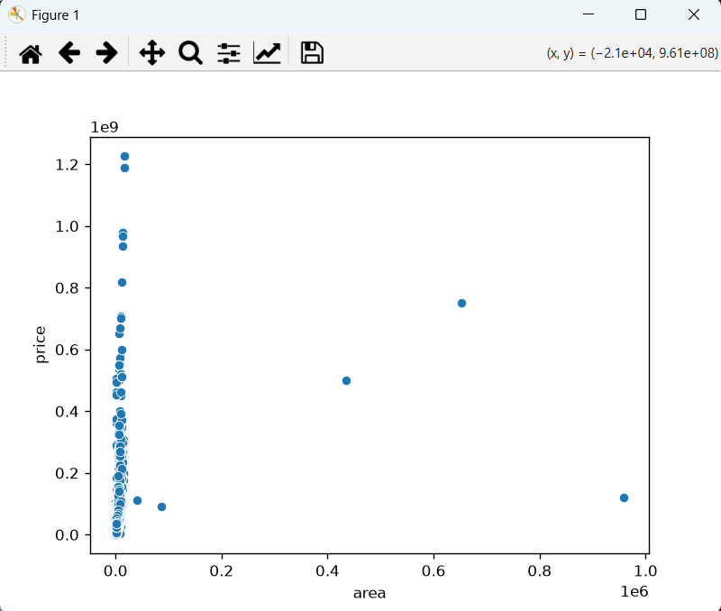
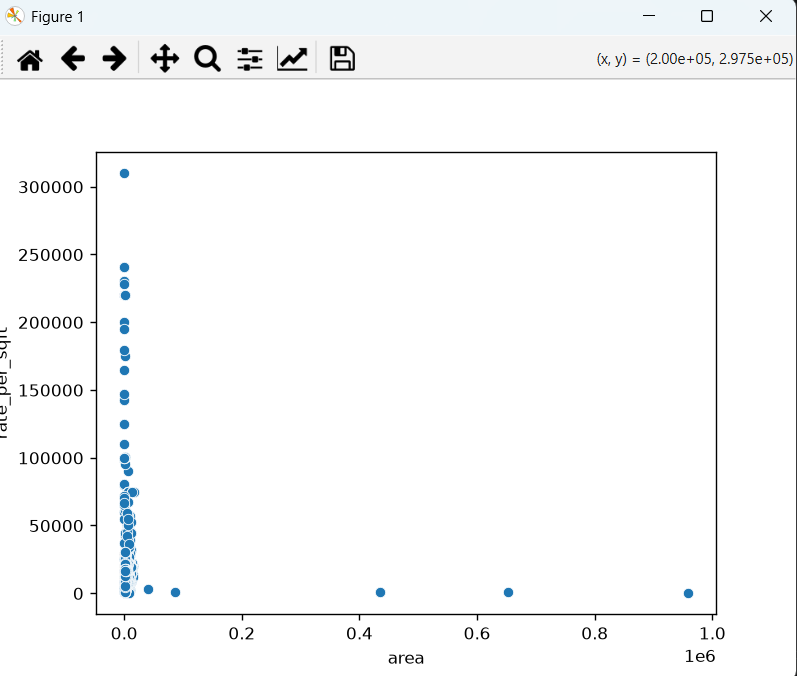

# Gurgaon Real Estate Analysis

## Project Overview

A Python-based data analysis project focused on Gurgaon real estate properties.

The project analyzes property prices, localities, area, rate per square foot, BHK configurations, property types, RERA approval, and builders/companies to identify real estate pricing patterns.

## Tools & Libraries

- Python
- Pandas
- NumPy
- Matplotlib
- Seaborn
  

## Business Questions

1. Which is the costliest flat?
2. Which locality has the highest average price?
3. Which locality has the highest rate per square foot?
4. Do ready-to-move properties cost more than under-construction properties?
5. How does area (sqft) impact property price?
6. Which property type is the costliest?
7. Which BHK configuration is most expensive based on per sqft rate?
8. Are larger homes more expensive per sqft?t?

## Visualizations

### Area vs Price

### Area vs Rate per Square Foot

## Key Analysis

The project uses data cleaning, grouping, aggregation, and visualization techniques to analyze Gurgaon real estate pricing patterns.

## Conclusion

This analysis helps understand how factors such as locality, area, BHK configuration, property type, RERA approval, and builders/companies are associated with property pricing in the dataset.
